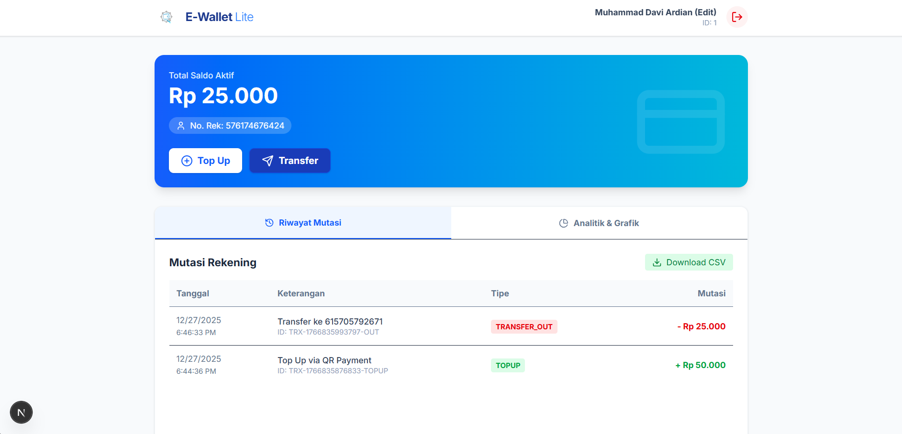

# E-Wallet Lite - Microservices Platform

**E-Wallet Lite** adalah platform simulasi dompet digital (Fintech) yang dibangun menggunakan arsitektur **Microservices**. Proyek ini mendemonstrasikan implementasi sistem terdistribusi yang mencakup manajemen identitas (profile), saldo & no.rekening, transaksi transfer antar pengguna, pembayaran via QR Code (Top Up), dan analitik data menggunakan BigQuery.

 

## Fitur Utama

### 1. 🔐 Identity & Security
- **Registrasi & Login:** Menggunakan JWT (JSON Web Token) untuk otentikasi.
- **PIN Security:** Validasi PIN 6 digit yang di-hash (Bcrypt) untuk setiap transaksi sensitif.
- **Profile Management:** Edit nama, password, dan PIN.

### 2. 💰 Wallet & Transaction
- **Rekening Unik:** Auto-generate 12 digit nomor rekening saat registrasi.
- **Transfer Dana:** Transfer antar pengguna secara real-time dengan validasi saldo dan PIN.
- **Atomic Transactions:** Menjamin integritas data saldo (tidak bisa negatif) menggunakan transaksi database ACID.
- **Double-Entry Recording:** Mencatat mutasi keluar (Debit) di pengirim dan mutasi masuk (Kredit) di penerima secara terpisah.

### 3. 📲 QR Payment (Top Up)
- **Dynamic QR Code:** Menghasilkan QR unik untuk setiap request Top Up.
- **Real-time Approval:** Menggunakan mekanisme *Polling* di Frontend untuk mendeteksi pembayaran sukses secara otomatis tanpa refresh.
- **Public Access Simulation:** Mendukung simulasi scan HP menggunakan **Serveo** untuk akses dari jaringan eksternal.

### 4. 📊 Analytics & Reporting
- **Google BigQuery Integration:** Data transaksi dikirim ke BigQuery untuk analisis OLAP (Online Analytical Processing).
- **Visualization:** Grafik statistik pengeluaran dan pemasukan di Dashboard.
- **Export CSV:** Fitur unduh riwayat mutasi dalam format CSV.

---

## Arsitektur Sistem

Sistem ini terdiri dari 6 container Docker yang saling berkomunikasi:

| Service | Port | Database | Deskripsi |
| :--- | :--- | :--- | :--- |
| **Frontend** | 8080 | - | Antarmuka pengguna (Next.js 14, Tailwind CSS). |
| **API Gateway** | 3000 | - | Pintu masuk tunggal (Reverse Proxy) yang membelokkan request ke service terkait. |
| **Identity Service** | 3001 | PostgreSQL (`identity_db`) | Menangani Auth, User Data, dan Validasi PIN. |
| **Wallet Service** | 3002 | PostgreSQL (`wallet_db`) | Menangani Saldo dan Info Rekening. |
| **Transaction Service** | 3003 | PostgreSQL (`transaction_db`) | Logika Transfer dan Pencatatan Histori. |
| **Payment Service** | 3004 | In-Memory | Logika Top Up, QR Code, dan Callback Pembayaran. |
| **Analytics Service** | 3005 | Google BigQuery | Warehouse data untuk pelaporan. |

---

### Tech Stack

**Frontend:** Next.js, React, Tailwind CSS, Lucide Icons.

**Backend:** Node.js, Express.js.

**Database:** PostgreSQL (Relational), Google BigQuery (Data Warehouse).

**DevOps:** Docker, Docker Compose.

**Tools:** Axios, Bcrypt, JWT, http-proxy-middleware.

---

## Prasyarat (Prerequisites)

Sebelum menjalankan, pastikan memiliki:
1.  **Docker & Docker Compose**
2.  **Node.js**
3.  **Google Cloud Service Account Key** (`json`) dengan akses (Role) BigQuery Admin & Editor.

---

## Cara Menjalankan (Installation)

### 1. Persiapan Data
Pastikan file `gcp-key.json` (Service Account Google Cloud) sudah ada di folder `analytics-service`.

### 2. Setup Environment Variables
Untuk fitur QR Code agar bisa discan HP, perlu Public URL (Serveo).
Buka `docker-compose.yml` dan edit bagian `payment-service`:

```yaml
  payment-service:
    environment:
      - PUBLIC_URL=[https://url-serveo-anda.com](https://url-serveo-anda.com)
```

### 3. Running
Sebelum menjalankan perintah `docker-compose up --build` pada folder root proyek. Buka terminal lain dan lakukan perintah berikut ini (jangan di close) `ssh -R 80:localhost:3004 serveo.net` untuk mendapatkan Public URL (Serveo). Terakhir, edit file `docker-compose.yml` seperti pada tahap 2.